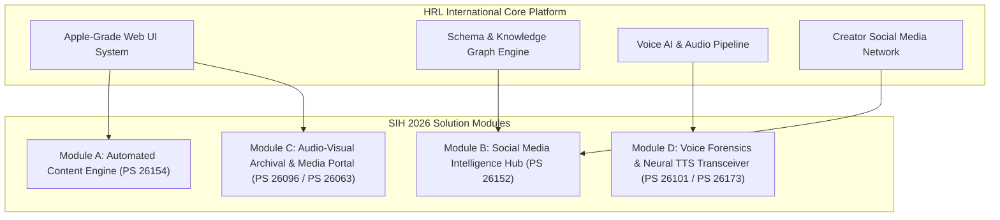

# 🗺️ Master Integration Blueprint: HRL International Tech Assets × SIH 2026

**Problem Statement Focus**: PS ID 26154 (*Gen AI Platform for Automated Content Transformation*) & Related Media Tracks  
**Author**: HRL International Pvt. Ltd. (Mangaluru, India)  

---

## 1. Executive Summary

This document bridges the existing codebase, brand architecture, and technology capabilities of **HRL International Pvt. Ltd.** with the matching **SIH 2026 Problem Statements**. 

By leveraging HRL's active digital infrastructure (Apple-grade UI design system, DaVinci/Blackmagic media pipelines, ElevenLabs Voice AI, and 2.5M+ impression creator distribution network), HRL's core technologies can be deployed directly to solve high-priority SIH 2026 challenges.

---

## 🗺️ Synergy Matrix: SIH 2026 PS ➔ HRL Technology Mapping

| SIH 2026 PS ID & Title | Sponsoring Ministry | HRL International Synergy | Implementation Strategy & Module Reusability |
| :--- | :--- | :--- | :--- |
| **PS 26154** **Gen AI Platform for Automated Content Transformation** | National Technical Research Organisation (NTRO) | **Core Business Fit (100% match)**: HRL’s primary focus is AI-driven multimodal content creation, converting raw briefings/news into multi-platform digital assets. | Deploy HRL's automated pipeline: Ingest reports/news ➔ Extract key insights via LLM ➔ Generate branded slide decks, social cards, executive briefs, and audio summaries automatically. |
| **PS 26152** **Social Media Analytics** | National Technical Research Organisation (NTRO) | **Creator & Brand Network Fit**: HRL already operates across social hubs (`@hrlstayupdated`, LinkedIn, YouTube, Instagram). | Integrate sentiment scoring, trend forecasting, and entity network graphs (using HRL's Knowledge Graph architecture) to analyze viral spread and audience demographics. |
| **PS 26096** **Digital Heritage Archive & Audio-Visual Knowledge Platform** | Ministry of Social Justice and Empowerment (MoSJE) | **Audio-Visual Engineering Fit**: HRL’s post-production & DaVinci Resolve media workflow aligns directly with historical speech/video restoration. | Build a searchable audio-visual repository with Whisper-based speech-to-text, OCR transcription, semantic vector search, and interactive historical timeline views. |
| **PS 26063** **Polar Science Outreach & Media Dissemination Portal** | Ministry of Earth Sciences (MoES) | **Media Dissemination & UI Fit**: HRL’s Apple-standard design system, media CDN hosting, and public dissemination architecture. | Adapt HRL's web platform into a high-performance public science media portal with interactive 3D station exhibits, media kits, press release workflows, and reach analytics. |
| **PS 26101** **AI-Powered Real-Time Detection of Voice Cloning Attacks** | Indian Cyber Crime Coordination Centre (I4C) | **Voice AI & Forensics Fit**: Extends HRL's Voice AI stack (ElevenLabs integration) into defensive acoustic forensic analysis. | Implement real-time spectral anomaly detection and vocoder artifact analysis to identify synthetic/cloned audio in live streams. |
| **PS 26173** **iTantra: Multilingual TTS & STT Transceiver for Low-Bitrate Links** | ISRO | **Generative Audio Fit**: Multilingual neural speech synthesis and compressed voice codecs. | Deploy lightweight on-device TTS/STT neural pipelines to transmit speech tokens across low-bandwidth channels. |
| **PS 26199 / 26216** **Student Innovation – Tertiary: Entertainment, Hospitality & Retail** | AICTE | **Flagship Startup Product**: Direct submission of HRL International’s proprietary media engineering & creator suite. | Package HRL International's complete creator media infrastructure, AI brand tools, and automated media engine as a standalone submission. |

---

## 🛠️ Step-by-Step Implementation Roadmap

---

### Module 1: Automated Content Transformation Engine (`PS 26154`)
* **Objective**: Transform text/PDF/audio into production-ready social media content, press releases, and executive decks.
* **Architecture**:
  1. **Input**: Drag-and-drop research papers, government advisories, or raw news.
  2. **LLM Orchestration**: Structured extraction (Key Points, Citations, Action Items).
  3. **Visual Media Renderer**: Automated HTML-to-Image / Canvas generation for social graphics, infographics, and PDF briefing packs.
  4. **Output Channels**: Export to LinkedIn carousel format, Twitter/X threads, press releases, and audio snippets.

---

### Module 2: Social Media Intelligence & Trend Forecasting (`PS 26152`)
* **Objective**: Monitor public sentiment, trace narrative propagation, and score influence.
* **Architecture**:
  1. **Ingestion**: Multi-platform feeds (Twitter/X, YouTube comments, Reddit, Instagram).
  2. **NLP Engine**: Multilingual sentiment analysis (IndicBERT / RoBERTa) + aspect-based sentiment categorization.
  3. **Entity Knowledge Graph**: Connect user nodes, hashtags, and topics using Neo4j / NetworkX to uncover coordinated influence patterns.
  4. **Analytics Dashboard**: Interactive D3.js charts embedded inside HRL's Apple-style bento grid UI.

---

### Module 3: Audio-Visual Archiving & Digital Dissemination (`PS 26096` & `PS 26063`)
* **Objective**: Preserve and broadcast high-fidelity multimedia assets with searchable transcriptions and interactive exhibits.
* **Architecture**:
  1. **Media Ingestion**: High-resolution video/audio upload with automated chunking via FFmpeg.
  2. **AI Transcriber**: Whisper-based speech-to-text with word-level timestamps.
  3. **Semantic Search**: Vector embeddings (Qdrant / Milvus) allowing natural language search (e.g., *"Find the part where the speech discusses education reforms"*).
  4. **Interactive 3D Stage**: Three.js / WebGL virtual walk-through of historical memorials or polar research stations.

---

## 🏆 Strategic Hackathon Advantages for HRL International

1. **Working Production Baseline**: Unlike standard teams starting from scratch, HRL International already possesses a live production domain, verified Schema graph, certified credentials, and design system.
2. **Real Creator Metric Proof**: Backed by 2.5M+ organic impressions and a genuine creator media network, giving real-world credibility to judge evaluations.
3. **Dual Submission Track**: Ability to submit targeted solutions for specific Ministry statements (NTRO / MoES / MoSJE / I4C) OR enter the Open Innovation Track (`PS 26199`) with HRL's full platform.
