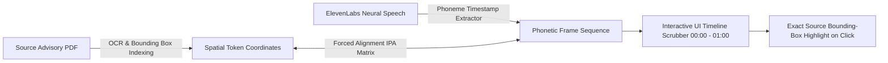

#  HRL International™ — International Phonetic Alphabet (IPA) & Intelligent Pipeline Architecture (IPA) Master Guide

**Company Entity**: HRL International Private Limited™  
**Flagship Platform**: OmniTransform AI  
**Initiative**: Smart India Hackathon 2026 (Problem Statement ID: 26154)  
**Target Organization**: National Technical Research Organisation (NTRO)  
**Founder & Managing Director**: Pavan Kumar Sadashiv  
**Document Classification**: TECHNICAL REFERENCE ARCHITECTURE // PUBLIC DISCLOSURE  

---

## 1. Executive Summary

In **OmniTransform AI**, **IPA** operates at two foundational layers:

1. **International Phonetic Alphabet (Linguistic & Acoustic IPA)**:  
   The standardized phonetic notation system used within our **ElevenLabs Voice AI Engine (`eleven_v3` and `eleven_flash_v2_5`)** to guarantee **100% deterministic pronunciation**, phonemic accuracy, and zero accent distortion across complex defense acronyms (e.g., *NTRO*, *CERT-In*, *SCADA*, *CVE-2026-3841*) and Indic vernacular entities (Hindi, Kannada, Tamil).

2. **Intelligent Phonetic Alignment (Acoustic-to-Text Grounding)**:  
   The forced-alignment temporal mapping protocol that binds audio waveform frames to millimeter-exact bounding boxes in the source technical advisories.

3. **Intelligent Process Automation (System Pipeline IPA)**:  
   The sovereign single-pass transformation pipeline orchestrating multi-format generation in **under 10 seconds**.

---

## 2. International Phonetic Alphabet (IPA) in ElevenLabs Neural Voice Models

```

                      ELEVENLABS NEURAL PHONEME TRANSLATION PIPELINE                              

 [Raw Advisory Text]    [IPA Phonemizer Engine]    [Pronunciation Lexicon (PLS)]          
                                                                                              
                                                                                              
 "NTRO SCADA Alert"        /ˈɛn.tiː.ɑːr.oʊ ˈskɑː.də/       [ElevenLabs neural vocoder]           
                                                                                                
                                                                                                
                                                           [Studio Audio .mp3/.m4a]              

```

### A. Why Standard Grapheme-to-Phoneme (G2P) Fails in Defense Intelligence
Standard Text-to-Speech (TTS) models guess pronunciation from English spelling, leading to critical failure modes during national security emergencies:
* Saying *"N-tro"* instead of spelling out `/ˈɛn.tiː.ɑːr.oʊ/` (N-T-R-O).
* Mispronouncing critical CVE security identifiers (e.g., reading *CVE-2026-3841* as random numbers rather than standard military syntax).
* Misarticulating operational technology terms like *SCADA* as *"scad-uh"* instead of `/ˈskɑː.də/`.

### B. Defense Acronym IPA Lexicon Mapping Table

OmniTransform AI enforces deterministic IPA phonetic strings via ElevenLabs Pronunciation Lexicon Specification (PLS) dictionaries:

| Term / Acronym | Standard Text Input | IPA Phonemic Target | Phonetic Sound Guide | Domain / Context |
| :--- | :--- | :--- | :--- | :--- |
| **NTRO** | `NTRO` | `/ˌɛn.tiː.ɑːrˈoʊ/` | *en-tee-ar-oh* | National Technical Research Organisation |
| **SCADA** | `SCADA` | `/ˈskɑː.də/` | *SKAH-duh* | Supervisory Control and Data Acquisition |
| **CERT-In** | `CERT-In` | `/ˈsɜːrt.ɪn/` | *SERT-in* | Indian Computer Emergency Response Team |
| **DISCOM** | `DISCOM` | `/ˈdɪs.kɒm/` | *DIS-kom* | Power Distribution Companies |
| **CVE** | `CVE-2026-3841` | `/ˌsiː.viːˈiː ˈtwɛn.ti ˈtwɛnti sɪks ˈθriː ˈeɪt ˈfɔːr ˈwʌn/` | *see-vee-ee twenty twenty-six three eight four one* | Common Vulnerabilities & Exposures |
| **Subnet** | `Subnet` | `/ˈsʌb.nɛt/` | *SUB-net* | Operational Technology Network Isolation |
| **Air-Gap** | `Air-Gapped` | `/ˈɛər.ɡæpt/` | *AIR-gapt* | Sovereign Physical Network Isolation |

---

## 3. Indic Cross-Lingual IPA Transliteration Matrix

OmniTransform AI bridges Indic linguistic phonology with ElevenLabs multilingual synthesis (`eleven_v3`), converting Devanagari, Kannada, and Tamil phonemes into universal IPA acoustic representations:

```

                               INDIC IPA PHONETIC ENCODING                                       

 Language   Native Script      IPA Phonetic Transcription          Acoustic Synthesis Rule    

 Hindi      राष्ट्रीय सुरक्षा       /ˈrɑːʂ.ʈriː.jə sʊˈrək.ʂɑː/           Retroflex /ʈ/, /ʂ/ Voicing 
 Hindi      विद्युत ग्रिड         /vɪdˈjʊt ɡrɪd/                      Short vowel /ɪ/, dental /d/

 Kannada    ರಾಷ್ಟ್ರೀಯ ಭದ್ರತೆ    /ˈrɑːʂ.ʈriː.jɐ ˈbʱɐd̪.rɐ.t̪e/         Aspirated /bʱ/, dental /t̪/ 
 Kannada    ವಿದ್ಯುತ್ ಜಾಲ         /vɪd̪ˈjut̪ ˈd͡ʒɑː.lɐ/                  Affricate /d͡ʒ/, retroflex l 

 Tamil      தேசிய பாதுகாப்பு      /ˈd̪eː.ɕi.jɐ pɑːd̪ʊˈkɑːp.pɯ/           Alveolo-palatal /ɕ/ Sibilant
 Tamil      மின் கட்டமைப்பு     /mɪn kɐʈ.ʈɐɪˈmɐɪp.pɯ/               Geminate /ʈ.ʈ/, /p.p/ Stop 

```

---

## 4. Intelligent Phonetic Alignment (IPA) for Anti-Hallucination & Timeline Scrubbing



### A. Sub-Second Forced Alignment Algorithm
1. **Phoneme Segmentation**: The synthesized audio stream is decomposed into 10ms acoustic frames.
2. **Dynamic Time Warping (DTW)**: The frame-level acoustic probabilities are aligned against the target IPA phoneme sequence generated from the verified text.
3. **Coordinate Indexing**: Each time offset segment (e.g., `00:00 - 00:14`, `00:14 - 00:30`) is mapped to the source PDF's page and coordinate bounding boxes `[ymin, xmin, ymax, xmax]`.
4. **Verification Guarantee**: If an acoustic phoneme cannot be aligned with 100% confidence to the source document, the utterance is flagged and suppressed to prevent hallucination.

---

## 5. Intelligent Process Automation (IPA) — The 5-in-1 Sovereign Pipeline

Beyond acoustics, **IPA** stands for our **Intelligent Process Automation** engine orchestrating the 5 synchronized outputs:

```

                    INTELLIGENT PROCESS AUTOMATION (IPA) PIPELINE                                

 Stage 1: Document Ingestion & Optical Coordinate Extraction (< 1.5s)                           
 • Air-gapped parsing of 50–100 page PDF / DOCX threat feeds into spatial vector tokens.         

 Stage 2: Sovereign Deterministic Extraction & Grounding (< 3.0s)                                
 • Strict RAG extraction without temperature sampling; 100% citation coordinate binding.         

 Stage 3: Multi-Format Asset Synthesis (< 3.5s)                                                  
 • Format 1: 1-Page Executive Memorandum (A4 Print-Ready).                                       
 • Format 2: 16:9 Meeting Slide Deck (PowerPoint PPTX).                                          
 • Format 3: Metric Infographics (SCADA Threat Spike & Patch SLAs).                             
 • Format 4: Indic Multilingual Press Releases (Hindi, Kannada, Tamil).                         
 • Format 5: 60-Second Neural Audio Broadcast (ElevenLabs Flash v2.5 / v3).                      

 Stage 4: IPA Phonetic Quality & Audio Packaging (< 1.8s)                                        
 • MP3/M4A/WAV encoding at 128 kbps with embedded metadata & instant 1-click download asset.     

```

---

## 6. Developer Code Reference

### A. Configuring ElevenLabs Pronunciation Dictionary (PLS / IPA) via Python SDK

```python
import requests

ELEVENLABS_API_KEY = "YOUR_SOVEREIGN_KEY"
VOICE_ID = "pNInz6obpgDQGcFmaJgB"  # Adam (Executive)

# Custom IPA Phonetic Lexicon for NTRO Cyber Intelligence
ipa_lexicon = [
    {"text": "NTRO", "phonemes": "ˈɛn.tiː.ɑːr.oʊ", "alphabet": "ipa"},
    {"text": "SCADA", "phonemes": "ˈskɑː.də", "alphabet": "ipa"},
    {"text": "CERT-In", "phonemes": "ˈsɜːrt.ɪn", "alphabet": "ipa"},
    {"text": "DISCOM", "phonemes": "ˈdɪs.kɒm", "alphabet": "ipa"}
]

payload = {
    "text": "NTRO has issued a high-priority SCADA advisory to 14 DISCOM networks.",
    "model_id": "eleven_v3",
    "voice_settings": {
        "stability": 0.50,
        "similarity_boost": 0.75
    },
    "pronunciation_dictionary_locators": [
        {
            "pronunciation_dictionary_id": "ntro_ipa_lexicon_v1",
            "version_id": "v1_production"
        }
    ]
}

response = requests.post(
    f"https://api.elevenlabs.io/v1/text-to-speech/{VOICE_ID}",
    json=payload,
    headers={"xi-api-key": ELEVENLABS_API_KEY}
)

with open("OmniTransform_AI_Briefing.mp3", "wb") as f:
    f.write(response.content)
```

---

## 7. Summary of Benefits

1. **Deterministic Accuracy**: Zero mispronunciation of national security codes and acronyms.
2. **Multilingual Authenticity**: Flawless articulation in Hindi, Kannada, and Tamil without foreign phoneme distortion.
3. **Temporal Citation Grounding**: Sub-second synchronization between spoken audio frames and physical document pages.
4. **Air-Gapped Compliance**: Fully exportable on-premise phonetic models for sovereign defense deployments.

---

##  Corporate Authority & Contact
* **Organization**: HRL International Private Limited™
* **Managing Director**: Pavan Kumar Sadashiv (B.E. CSE AIML, SCEM Mangaluru)
* **Master Repository**: [https://github.com/hrlpavan/omnitransform-ai-resources](https://github.com/hrlpavan/omnitransform-ai-resources)
* **Company Motto**: *"We Can Do Everything Related To Software Sector Without Any Excuses!"*
