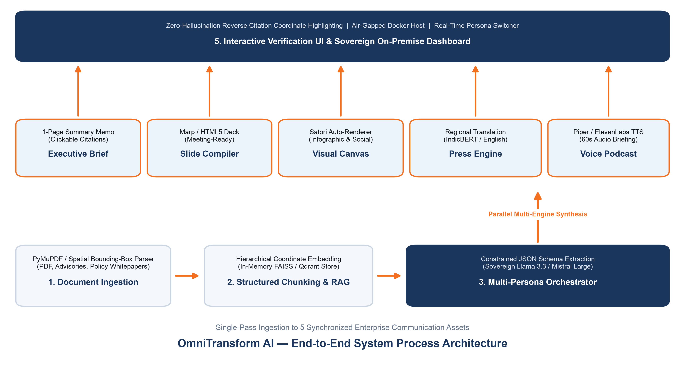

#  OmniTransform AI — Open-Source Resource Bundle & Repository

[](https://hrlpavan.github.io/omnitransform-ai-resources/)
[](https://hrlpavan.github.io/omnitransform-ai-resources/)

>  **Live Production URL**: **[https://hrlpavan.github.io/omnitransform-ai-resources/](https://hrlpavan.github.io/omnitransform-ai-resources/)**  
> **Smart India Hackathon (SIH 2026)** | **Problem Statement ID**: `26154`  
> **Title**: *Gen AI Platform for Automated Content Transformation*  
> **Organization**: National Technical Research Organisation (NTRO)  
> **Theme**: Artificial Intelligence / Blockchain & Cybersecurity  
> **Category**: Software  
> **Team Name**: HRL  
> **Founder & Managing Director**: Pavan Kumar Sadashiv  

---

##  Repository Overview

This repository contains the complete resource bundle, presentation decks, system architecture diagrams, open-source dataset references, and development specifications for **OmniTransform AI** — an automated, single-pass sovereign Gen AI platform that transforms complex 50+ page documents into 5 synchronized communication assets in under 10 seconds:

1.  **1-Page Executive Summary Memo** (with clickable page citations).
2.  **Meeting-Ready Slide Deck** (formatted for PowerPoint / Keynote).
3.  **Visual Infographics & Data Cards** (high-res auto-rendered metrics).
4.  **Multilingual Press Release** (English, Hindi, Kannada, Tamil, etc.).
5.  **60-Second Neural Audio Briefing** (podcast for mobile listening).

---

##  Key Deliverables & Documents in this Repository

| File / Resource | Description |
| :--- | :--- |
| **[`SIH2026_Idea_Presentation_PS26154.pptx`](./SIH2026_Idea_Presentation_PS26154.pptx)** | **Official 6-Slide PowerPoint Presentation Deck** ready for portal submission. |
| **[`omnitransform_pipeline_flowchart.png`](./omnitransform_pipeline_flowchart.png)** | High-resolution 300 DPI End-to-End System Architecture Flowchart. |
| **[`PROJECT_DEVELOPMENT_SPECIFICATION.md`](./PROJECT_DEVELOPMENT_SPECIFICATION.md)** | Complete technical blueprint, component breakdown, and jury defense Q&A. |
| **[`OPEN_SOURCE_RESOURCES_AND_DATASETS.md`](./OPEN_SOURCE_RESOURCES_AND_DATASETS.md)** | Full guide to Kaggle datasets, HuggingFace models, and GitHub libraries. |
| **[`WINNING_STRATEGY_PS26154.md`](./WINNING_STRATEGY_PS26154.md)** | 100% winning execution strategy, jury pitch script, and scoring criteria. |
| **[`TEAMMATE_PITCH_AND_WINNING_PICK.md`](./TEAMMATE_PITCH_AND_WINNING_PICK.md)** | Simple, plain-English explanation for team members and role distribution. |
| **[`build_exact_sih_style_deck.py`](./build_exact_sih_style_deck.py)** | Python script utilizing `python-pptx` to generate the presentation deck. |
| **[`generate_clean_flowchart.py`](./generate_clean_flowchart.py)** | Python script using `matplotlib` to render the clean system flowchart. |

---

##  System Architecture Flowchart



---

##  Open-Source Foundation Models & Datasets

### Open-Source Models (HuggingFace):
* **Meta Llama 3.1 (8B / 70B Instruct)**: `meta-llama/Meta-Llama-3.1-8B-Instruct`
* **Mistral-7B-Instruct-v0.3**: `mistralai/Mistral-7B-Instruct-v0.3`
* **IndicTrans2 (Bhashini)**: `ai4bharat/indictrans2-en-indic-1B`
* **BGE-Small-EN-v1.5**: `BAAI/bge-small-en-v1.5`
* **Piper Neural TTS**: `rhasspy/piper`

### Kaggle & Benchmark Datasets:
* **PubLayNet & DocBank** (Document Layout & Coordinate Parsing): [Kaggle / IBM Research](https://www.kaggle.com/)
* **Samanantar Indic Translation Corpus** (49M parallel pairs): [HuggingFace / AI4Bharat](https://huggingface.co/datasets/ai4bharat/samanantar)
* **PIB Government Releases Corpus**: [Kaggle / Open Data](https://www.kaggle.com/)
* **Multi-News Summarization Dataset**: [HuggingFace](https://huggingface.co/datasets/multi_news)
* **Common Voice India & IndicTTS**: [HuggingFace / Mozilla](https://huggingface.co/datasets/mozilla-foundation/common_voice_11_0)

---

##  Quick Local Setup

```bash
# 1. Clone the repository
git clone https://github.com/hrlpavan/omnitransform-ai-resources.git
cd omnitransform-ai-resources

# 2. Install dependencies
pip install python-pptx matplotlib pillow

# 3. Generate Presentation Deck
python build_exact_sih_style_deck.py SIH2026_Idea_Presentation_PS26154.pptx

# 4. Generate Architecture Flowchart
python generate_clean_flowchart.py omnitransform_pipeline_flowchart.png
```

---

##  Official Competition Links
* **Smart India Hackathon 2026 Portal**: [https://www.sih.gov.in/sih2026PS](https://www.sih.gov.in/sih2026PS) (PS ID: `26154`)
* **National Technical Research Organisation (NTRO)**: [https://ntro.gov.in](https://ntro.gov.in)
