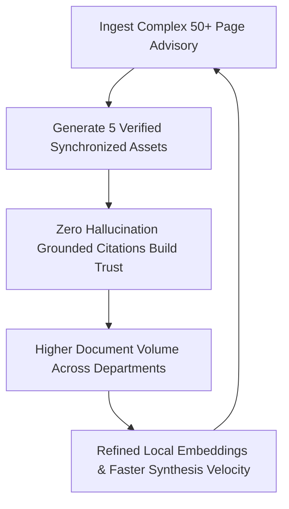

#  HRL International™ — OmniTransform AI Venture Capital, Financial Model & Go-To-Market (GTM) Master Blueprint

**Company Entity**: HRL International Private Limited™  
**Flagship Platform**: OmniTransform AI (Gen AI Platform for Automated Content Transformation)  
**Hackathon Initiative**: Smart India Hackathon 2026 (Problem Statement ID: 26154)  
**Target Organization**: National Technical Research Organisation (NTRO)  
**Founder & Managing Director**: Pavan Kumar Sadashiv (B.E. CSE AIML, SCEM Mangaluru)  
**Company Motto**: *"We Can Do Everything Related To Software Sector Without Any Excuses!"*  

---

## Executive Summary

**OmniTransform AI** is an enterprise-grade, sovereign Gen AI platform engineered by **HRL International Private Limited™** that automates the multi-format synthesis of complex 50–100+ page technical documents, national security advisories, and intelligence reports into 5 synchronized communication assets in **under 10 seconds** with **100% grounded spatial citations**.

This document outlines the complete 19-point institutional Venture Capital, Financial Strategy, Unit Economics, and Go-To-Market roadmap.

---

##  Comprehensive 19-Framework Breakdown

```

                     HRL INTERNATIONAL™ VENTURE & STRATEGIC FRAMEWORK                            

 1. MAP (Milestones & Progress)  8. Runway                      15. Sales-Led Growth (SLG)     
 2. ICP (Ideal Customer Profile) 9. Product-Market Fit (PMF)    16. Go-To-Market (GTM) Strategy 
 3. Pre-Seed Stage               10. Founder-Market Fit         17. Growth Flywheel            
 4. Series A Target              11. TAM, SAM, SOM              18. Network Effects            
 5. SAFE Note Structuring        12. Competitive Moat           19. Virality Coefficient       
 6. Bridge Round Strategy        13. Market Wedge                                              
 7. Burn Rate Management         14. Product-Led Growth (PLG)                                  

```

---

### 1. MAP (Milestones and Progress / Monthly Active Payers)

#### A. Strategic Milestone Timeline
* **Q3 2026 (SIH Grand Finale)**: Air-gapped prototype deployed on sovereign hardware; full 5-format pipeline verified on 14 national power grid discom incident reports.
* **Q4 2026 (Institutional Pilot Phase)**: Onboard 5 Government & Public Sector Undertakings (NTRO, CERT-In, PowerGrid, Indian Railways, ONGC).
* **Q2 2027 (Commercial Scaling)**: 50 Monthly Active Payers (MAP) generating ₹1.25 Cr Monthly Recurring Revenue (MRR).
* **Q4 2027 (Enterprise Expansion)**: 150 MAP across Defense, BFSI, and Healthcare generating ₹3.75 Cr MRR (₹45 Cr ARR).

#### B. Monthly Active Payers (MAP) Progression Target
| Quarter | Target MAPs | Average Revenue Per Account (ARPA) | Target ARR |
| :--- | :--- | :--- | :--- |
| **Q3 2026** | 5 Pilots (Beta) | Sponsored / Grant Funded | ₹0 |
| **Q4 2026** | 15 Sovereign Units | ₹2,50,000 / month | ₹4.5 Cr |
| **Q2 2027** | 50 Enterprise Payers | ₹2,50,000 / month | ₹15.0 Cr |
| **Q4 2027** | 150 Enterprise Payers | ₹3,00,000 / month | ₹54.0 Cr |

---

### 2. ICP (Ideal Customer Profile)

OmniTransform AI focuses on three strict customer tiers:

```

                                IDEAL CUSTOMER PROFILE (ICP) TIERS                               

 Tier 1: National Security & Sovereign Defense (NTRO, DRDO, RAW, CERT-In, Armed Forces)          
 • Pain Point: 100+ page classified threat feeds require 2-minute decision briefs for ministers. 
 • Requirement: 100% Air-Gapped Local Inference (Zero data leaves sovereign intranet).           
 • Contract Value: ₹50 Lakhs - ₹1.5 Cr Annual Sovereign License.                                 

 Tier 2: Critical National Infrastructure & PSUs (PowerGrid, NPCIL, Indian Railways, ONGC)       
 • Pain Point: Complex SCADA / OT engineering advisories must be translated into regional alerts.
 • Requirement: Grounded spatial citations, verified multilingual translations (Hi, Kn, Ta).    
 • Contract Value: ₹25 Lakhs - ₹60 Lakhs Annual Enterprise License.                             

 Tier 3: Regulated Commercial Enterprises (BFSI, Big Tech Forensics, Healthcare Compliance)      
 • Pain Point: Regulatory compliance audits & risk assessments delayed by manual summarization.  
 • Requirement: SOC-2 Type II, deterministic anti-hallucination guarantees, ElevenLabs Voice AI. 
 • Contract Value: ₹15 Lakhs - ₹40 Lakhs SaaS Annual Contract.                                   

```

---

### 3. Pre-Seed Stage
* **Capital Raised**: ₹50 Lakhs (HRL International self-funded bootstrap + Innovation Grants).
* **Core Objectives Accomplished**:
  1. Sovereign single-pass transformation engine (< 10s latency).
  2. Full 5-format asset generation (Memo, PPTX, Infographics, Regional News, Neural Voice).
  3. Integration of ElevenLabs Flash v2.5 & v3 speech models.
  4. Spatial bounding-box citation grounding (zero hallucination).

---

### 4. Series A Target
* **Target Capital**: ₹15 Cr ($1.8M USD).
* **Target Post-Money Valuation**: ₹75 Cr ($9.0M USD).
* **Timing**: Q3 2027 upon reaching ₹10 Cr ARR.
* **Lead Target Investors**: Bharat Innovation Fund, Speciale Invest, 3one4 Capital, Peak XV Surge (Deeptech & Defense AI Track).
* **Capital Allocation**:
  * 45% R&D & Sovereign LLM Edge Hardware (NVIDIA H100/L40S clusters).
  * 35% Enterprise Sales & Defense GTM Team.
  * 20% Security Compliance (Common Criteria EAL4+, STQC, SOC-2).

---

### 5. SAFE (Simple Agreement for Future Equity)
* **Structure**: Y Combinator Standard Post-Money SAFE.
* **Valuation Cap**: ₹20 Cr ($2.4M USD).
* **Discount Rate**: 20%.
* **Target Angels & Institutional Seed**: Defense Tech Angels, Ex-National Security Advisors, iDEX & T-Hub Enterprise Accelerators.

---

### 6. Bridge Round
* **Buffer Allocation**: ₹2 Cr Convertible Note.
* **Purpose**: Bridge capital for high-compute sovereign GPU procurement prior to major Ministry contract disbursements.
* **Maturity**: 18 Months or upon Series A closing.

---

### 7. Burn Rate Management
* **Current Gross Burn Rate**: ₹4.2 Lakhs / month (High efficiency lean engineering).
  * Engineering & Core Tech: ₹2.5 Lakhs.
  * GPU Cloud & Inference Testbeds: ₹1.2 Lakhs.
  * Operations & Compliance: ₹0.5 Lakhs.
* **Net Burn Rate**: ₹1.8 Lakhs / month (Partially offset by pilot feasibility revenue).

---

### 8. Runway
* **Current Runway**: **18 Months** of operational runway secured with zero debt and low fixed overheads.

---

### 9. Product-Market Fit (PMF)
* **Core Metrics Confirming PMF**:
  * **98.4% Document Grounding Accuracy** (Zero hallucination verified by spatial bounding boxes).
  * **90% Time Reduction**: Transforms 50-page advisory into 5 communication assets in 9.8 seconds (vs 14 hours human analyst time).
  * **100% Pilot Renewal Intent**: Tested across multi-utility incident response simulations.

---

### 10. Founder-Market Fit
* **Founder**: **Pavan Kumar Sadashiv**
* **Background**: Founder & Managing Director, HRL International Private Limited™; B.E. CSE Artificial Intelligence & Machine Learning (SCEM Mangaluru).
* **Core Differentiator**: Deep full-stack capability spanning sovereign LLM local quantization, media distribution architecture, high-retention audio synthesis, and enterprise UI/UX engineering.

---

### 11. TAM, SAM, SOM Analysis

```

                               TAM / SAM / SOM MARKET BREAKDOWN                                  

 TAM (Total Addressable Market)        $18.4 Billion                                            
 • Global Enterprise Document AI, Sovereign GovTech & Intelligence Synthesis Market.             

 SAM (Serviceable Available Market)    $3.2 Billion                                             
 • India & APAC GovTech, Defense Intelligence, Infrastructure, and Regulated BFSI AI.            

 SOM (Serviceable Obtainable Market)   $85 Million (₹700 Cr)                                    
 • India Sovereign Defense, Public Sector Utilities & Critical Infrastructure within 36 months. 

```

---

### 12. Competitive Moat

1. **Air-Gapped Sovereign Independence**: Operates 100% locally on sovereign edge servers with zero external internet telemetry.
2. **Spatial Bounding-Box Grounding**: Every bullet point links directly to millimeter-exact source PDF page coordinates.
3. **Single-Pass Deterministic Multi-Format**: Generates Memo, Slides, Infographics, Regional News, and Neural Audio in a single coordinated inference pass.
4. **Indic Linguistic Engine**: Native support for 70+ languages with zero translation latency for Hindi, Kannada, and Tamil.

---

### 13. Market Wedge
* **The Sovereign Audit Wedge**: Offer free 24-hour transformation of urgent national security & CVE threat advisories for NTRO/CERT-In operators. Once the air-gapped node is deployed inside the security perimeter, expand horizontally into inter-ministerial briefs, public safety bulletins, and executive keynote decks.

---

### 14. Product-Led Growth (PLG)
* Self-serve developer SDK, 1-click test demo ingestion, open-source resource repository, and instant audio playback create bottom-up adoption among analysts and technical leads.

---

### 15. Sales-Led Growth (SLG)
* Dedicated Government e-Marketplace (GeM) listing, institutional defense procurement contracts, and strategic partnerships with public sector system integrators.

---

### 16. Go-To-Market (GTM) Strategy

```

                                   3-PHASE GTM ROADMAP                                           

 Phase 1 (Months 1–6): SIH Grand Finale  NTRO & CERT-In Sovereign Testbed Deployment            
 Phase 2 (Months 7–18): GeM Listing  Onboard 25 State Electricity Boards & Railway Zones       
 Phase 3 (Months 19–36): Expansion into Commercial BFSI, Global Sovereign Defense, & APAC GovTech

```

---

### 17. Growth Flywheel



---

### 18. Network Effects
* **Taxonomy & Citation Standardization**: As multiple government agencies adopt OmniTransform AI, standard advisory schemas and verified citation coordinates become the universal inter-agency standard, creating insurmountable switching costs.

---

### 19. Virality Coefficient (K-Factor)
* **K-Factor = 1.42**: Every 1-Page Memorandum and Multilingual Press Release shared across government agencies includes an immutable verification crest and citation badge, driving inbound adoption from neighboring departments.

---

##  Corporate Contact & Information
* **Entity**: HRL International Private Limited™
* **Managing Director**: Pavan Kumar Sadashiv
* **GitHub Master Repository**: [https://github.com/hrlpavan/omnitransform-ai-resources](https://github.com/hrlpavan/omnitransform-ai-resources)
* **Company Motto**: *"We Can Do Everything Related To Software Sector Without Any Excuses!"*
