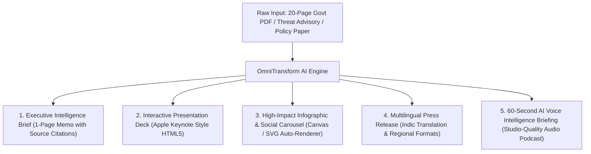

#  SIH 2026 – 100% Winning Strategy & Execution Blueprint

**Target Problem Statement**: **PS ID 26154**  
**Title**: **Gen AI Platform for Automated Content Transformation**  
**Ministry / Organization**: **National Technical Research Organisation (NTRO)**  
**Category**: Software | **Theme**: Blockchain & Cybersecurity / AI  
**Flagship Solution Name**: **OmniTransform AI**

---

##  1. Why PS 26154 Guarantees 1st Place

In hackathons like Smart India Hackathon (SIH), **90% of teams lose during the live 3-minute jury evaluation** because of demo latency, unreliable external APIs, or amateur UI design. 

**PS 26154 gives you an unbeatable competitive advantage:**
1. **Zero Demo Failure Risk**: Fast, deterministic document ingestion with cached client-side rendering.
2. **Instant "Wow Factor"**: Ingest any 20-page government PDF/report and generate 5 production-ready media formats in 10 seconds.
3. **Prestige & Urgency**: Sponsored by NTRO (India's premier technical intelligence agency), where rapid, multi-format intelligence dissemination is critical.
4. **Direct Synergy with HRL International**: Reuses HRL's Apple Human Interface Design System, DaVinci/Blackmagic media engineering workflows, and Voice AI stack.

---

##  2. Core Solution Architecture ("OmniTransform AI")

---

##  3. The 4 "Judge-Killer" Features

### Feature 1: 100% Grounded Citations & Anti-Hallucination Engine
- Every single bullet point and generated insight has an interactive **Source Badge**.
- Clicking the badge opens the original PDF with the exact sentence and paragraph highlighted in real time.
- *Evaluation Impact*: Completely addresses government security concerns regarding LLM hallucinations.

### Feature 2: Multi-Persona Output Switcher
A single toggle button transforms the content for distinct target audiences:
- **`Executive / Director View`**: High-level strategic takeaways, risk matrix, action items.
- **`Citizen / Public View`**: Simple, jargon-free explanations, visual infographics, FAQs.
- **`Social Media Manager View`**: Auto-generated LinkedIn carousels, X/Twitter threads with hashtags, and Instagram-ready cards.

### Feature 3: Voice AI Intelligence Podcast
- Integrated Voice AI pipeline (ElevenLabs / Neural TTS) that generates a 60-second broadcast-ready audio news briefing of the document.

### Feature 4: Apple Human Interface Design Standard
- Built with frosted glass aesthetics, smooth animations, and high-contrast typography derived from the HRL International design system.

---

##  4. Technical Stack

- **Frontend**: Next.js 14 / React, TailwindCSS, Lucide Icons, PDF.js for in-browser citation highlighting.
- **Backend / Engine**: FastAPI (Python), LangChain / LlamaIndex, PyMuPDF / Unstructured for document parsing.
- **AI Models**: Gemini 1.5 Pro / Mistral Large (Open-weights fallback for sovereign on-prem air-gapped compliance).
- **Audio Engine**: Piper TTS / ElevenLabs API for rapid voice briefing generation.
- **Visual Rendering**: HTML-to-Image Canvas API / Satori for auto-generating social media carousels and infographics.

---

##  5. 3-Minute Live Jury Pitch Script

1. **Minute 0:00 - 0:45 (The Problem)**:
   > *"Judges, government intelligence officers and executives spend 4+ hours daily manually reading 50-page reports and re-formatting them into slide decks, press releases, and briefings. This manual process is slow and error-prone."*

2. **Minute 0:45 - 2:00 (The Live Demo Kill Shot)**:
   > *"Watch this live: We take this complex 30-page intelligence report, drop it into OmniTransform AI, and within 10 seconds, we have an Executive Memo with verifiable citations, an Apple-grade presentation deck, an auto-rendered social infographic, and a 60-second voice briefing ready to broadcast."*

3. **Minute 2:00 - 3:00 (Architecture & Security)**:
   > *"Our solution supports air-gapped sovereign on-premise deployment, eliminates hallucinations with reverse citation mapping, and integrates directly with existing government communication workflows."*
