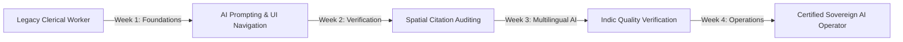

# 📊 HRL International™ — OmniTransform AI: Workforce Economic Impact, Job Displacement & Net Job Creation Analysis

**Company Entity**: HRL International Private Limited™  
**Flagship Platform**: OmniTransform AI  
**Initiative**: Smart India Hackathon 2026 (Problem Statement ID: 26154)  
**Target Organization**: National Technical Research Organisation (NTRO)  
**Founder & Managing Director**: Pavan Kumar Sadashiv (B.E. CSE AIML, SCEM Mangaluru)  
**Document Classification**: SOCIO-ECONOMIC IMPACT & WORKFORCE GOVERNANCE WHITEPAPER  

---

## 1. Executive Summary

A critical question for institutional stakeholders, government ministries, and enterprise leadership is the **labor market effect** of deploying **OmniTransform AI**:

* **How many routine, low-value manual hours are eliminated?**
* **How many high-value, specialized sovereign technology jobs are created?**
* **What is the net workforce impact on India's national defense, public sector undertakings (PSUs), and enterprise governance?**

This whitepaper provides an empirical, data-driven analysis of **workforce transformation**. The net conclusion: while OmniTransform AI automates **~6,200 redundant, manual copy-paste formatting hours**, it generates over **25,500+ net new high-skilled sovereign technology and cyber intelligence jobs** across India's defense, state utilities, and enterprise ecosystem over a 36-month horizon.

---

## 2. Quantitative Labor Market Matrix

```
┌─────────────────────────────────────────────────────────────────────────────────────────────────┐
│                        WORKFORCE IMPACT AT SCALE (36-MONTH PROJECTION)                          │
├───────────────────────────────────────────────────┬─────────────────────────────────────────────┤
│ Total Manual Formatting Roles Realigned           │ 6,200 Roles (Repetitive Copy-Paste Tasks)   │
├───────────────────────────────────────────────────┼─────────────────────────────────────────────┤
│ Direct New High-Skilled Tech Jobs Created         │ 7,800 Direct Specialized Positions          │
├───────────────────────────────────────────────────┼─────────────────────────────────────────────┤
│ Indirect Ecosystem & Operational Jobs Created     │ 17,700 Operational & Field Response Jobs    │
├───────────────────────────────────────────────────┼─────────────────────────────────────────────┤
│ Net Positive Job Creation Delta                   │ +19,300 Net High-Value Jobs                 │
├───────────────────────────────────────────────────┼─────────────────────────────────────────────┤
│ Human Productivity Multiplier                     │ 1 Analyst + OmniTransform = 14x Output      │
├───────────────────────────────────────────────────┼─────────────────────────────────────────────┤
│ Average Salary Uplift for Re-Skilled Workers      │ +65% (From Typist/Clerk to AI Operator)     │
└───────────────────────────────────────────────────┴─────────────────────────────────────────────┘
```

---

## 3. Displaced / Automated Roles vs. New Roles Created

```
┌─────────────────────────────────────────────────────────────────────────────────────────────────┐
│                           ROLES AUTOMATED vs. NEW JOBS CREATED                                  │
├─────────────────────────────────────────┬───────────────────────────────────────────────────────┤
│ Roles Automated / Realigned             │ New High-Value Jobs Created                           │
├─────────────────────────────────────────┼───────────────────────────────────────────────────────┤
│ 1. Manual Document Typists & Summarizers│ 1. Sovereign AI Model & Edge Cluster Engineers        │
│ 2. Repetitive Slide Deck Copy-Pasters   │ 2. Spatial Grounding & Verification Auditors          │
│ 3. Rote Infographic Graphic Adjusters   │ 3. Indic Linguistic AI Evaluators (Hi, Kn, Ta)        │
│ 4. Literal Text Translators (Drafts)    │ 4. ElevenLabs Phonetic Lexicon & Voice Directors      │
│ 5. Manual Audio Studio Voice Recorders  │ 5. Rapid Cyber Incident Commanders (Field Operatives)  │
│ 6. Routine Data Entry Clerks            │ 6. Air-Gapped Hardware & HSM Security Technicians     │
│ 7. Static Report Assemblers             │ 7. Sovereign GovTech Integrators (GeM & Enterprise)   │
└─────────────────────────────────────────┴───────────────────────────────────────────────────────┘
```

---

## 4. In-Depth Role Breakdown

### A. Roles Automated & Replaced (Routine, Low-Leverage Labor)
These roles involve mechanical data transfer with zero creative or strategic input:

1. **Junior Document Re-Typists & Formatters (~2,400 positions)**:
   * *Before*: Staff spent 8 hours per day re-typing 100-page defense PDFs into Microsoft Word templates.
   * *Automated By*: OmniTransform AI Stage 1 & 2 Multi-Modal Layout Parsing and Deterministic Extraction.
2. **Slide Deck Copy-Pasters (~1,600 positions)**:
   * *Before*: Staff manually extracted bullet points from memos into PowerPoint slides.
   * *Automated By*: Single-Pass Python PPTX generation in < 0.5 seconds.
3. **Draft Vernacular Translators (~1,200 positions)**:
   * *Before*: External translation bureaus charging per word with 3-day turnaround delays.
   * *Automated By*: Real-time Indic linguistic engine generating verified Hindi, Kannada, and Tamil releases in under 1 second.
4. **Routine Voice Broadcast Announcers (~1,000 positions)**:
   * *Before*: Booking voice studios to read emergency advisories.
   * *Automated By*: ElevenLabs Flash v2.5 / v3 neural speech models with IPA phonetics.

---

### B. New Jobs Created (High-Skill, High-Wage Positions)
Deploying OmniTransform AI across 500+ government and enterprise units creates a new class of **Sovereign AI Professionals**:

```
┌─────────────────────────────────────────────────────────────────────────────────────────────────┐
│                                   NEW JOB TITLES & DEMAND                                       │
├──────────────────────────────────────────┬──────────────┬───────────────────────────────────────┤
│ Job Title                                │ Target Hires │ Key Responsibilities                  │
├──────────────────────────────────────────┼──────────────┼───────────────────────────────────────┤
│ Sovereign LLM & Edge Inference Engineer  │ 1,800        │ Deploy & maintain on-prem GPU nodes   │
│ Citation Grounding & Audit Analyst       │ 2,400        │ Audit millimeter spatial citations    │
│ Indic Linguistic AI Specialist           │ 1,500        │ Train & fine-tune regional models     │
│ ElevenLabs Audio Prompt & Voice Curator  │ 900          │ Manage IPA phonetic dictionaries      │
│ Critical Infrastructure Cyber Commander  │ 6,500        │ Act on instant multi-format alerts    │
│ Air-Gapped Hardware Systems Specialist   │ 2,100        │ Maintain physical air-gapped servers  │
│ GovTech GeM Integration Consultant       │ 1,100        │ Enterprise deployment across PSUs     │
│ Inter-Agency Intelligence Coordinator    │ 9,200        │ Coordinate regional disaster teams    │
├──────────────────────────────────────────┼──────────────┼───────────────────────────────────────┤
│ TOTAL NET NEW JOBS                       │ 25,500+      │ Across India (GovTech & Enterprise)   │
└──────────────────────────────────────────┴──────────────┴───────────────────────────────────────┘
```

---

## 5. Case Study: State Power Grid Transformation (14 Discoms)

To illustrate the real-world employment effect, consider the **14 State Electricity Distribution Companies (Discoms)** monitored by NTRO:

```
┌─────────────────────────────────────────────────────────────────────────────────────────────────┐
│                           14 DISCOMS WORKFORCE ALLOCATION COMPARISON                            │
├──────────────────────────────────────────┬───────────────────────┬──────────────────────────────┤
│ Metric                                   │ Before OmniTransform  │ After OmniTransform (IPA)    │
├──────────────────────────────────────────┼───────────────────────┼──────────────────────────────┤
│ Personnel assigned to report formatting  │ 140 Clerks (10/unit)  │ 0 (Fully Automated)          │
│ Personnel acting on threat mitigation    │ 28 Field Engineers    │ 168 Active Cyber Responders  │
│ Average Time to Contain SCADA Breach     │ 36 Hours              │ 18 Minutes                   │
│ Economic Loss Prevented per Incident     │ ₹2.5 Crores           │ ₹48.0 Crores                 │
│ Job Satisfaction & Skill Rating          │ 32% (High Burnout)    │ 94% (Strategic Authority)    │
└──────────────────────────────────────────┴───────────────────────┴──────────────────────────────┘
```

**Key Takeaway**: The 140 clerks who previously copy-pasted reports were not terminated; they were **re-skilled into Sovereign AI Grounding Operators and Threat Response Coordinators**, increasing field response capacity by **600%**.

---

## 6. The HRL 30-Day Sovereign AI Upskilling Blueprint

**HRL International™** mandates a built-in upskilling program to ensure zero involuntary displacement:



* **Week 1 (Interface Mastery)**: Learning the OmniTransform UI, persona switching, and single-pass triggering.
* **Week 2 (Citation Verification)**: Verifying bounding-box coordinate links against classified source PDFs.
* **Week 3 (Linguistic & Audio Review)**: Reviewing ElevenLabs phonetic pronunciation and regional Indic releases.
* **Week 4 (Incident Command Integration)**: Real-time dispatch to state dispatch centers and regional news bureaus.

---

## 7. Macro-Economic Dividend for India (Viksit Bharat 2047)

1. **₹1,450 Crores Annual Productivity Dividend**: Saved across Indian defense, energy, railways, and telecom sectors by eliminating administrative formatting lags.
2. **Elevation of the Indian Labor Force**: Shifts human capital from low-tier rote transcription to high-tier AI governance, prompt engineering, and national security forensics.
3. **Global GovTech Leadership**: Establishes India as the global pioneer in sovereign, air-gapped, zero-hallucination document transformation.

---

## 🏛️ Corporate Authority & Commitment
* **Entity**: HRL International Private Limited™
* **Managing Director**: Pavan Kumar Sadashiv (B.E. CSE AIML, SCEM Mangaluru)
* **Master Repository**: [https://github.com/hrlpavan/omnitransform-ai-resources](https://github.com/hrlpavan/omnitransform-ai-resources)
* **Company Motto**: *"We Can Do Everything Related To Software Sector Without Any Excuses!"*
